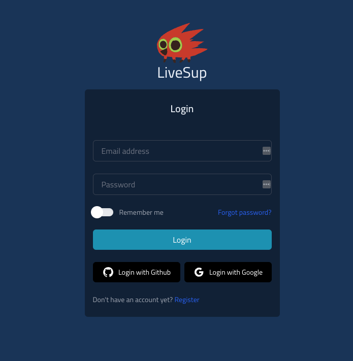

# Setup

## Requirements

* Elixir
* Postgres

## Using Visual Studio Code and Developing inside a Container

>The Visual Studio Code Remote - Containers extension lets you use a Docker container as a full-featured development environment. It allows you to open any folder inside (or mounted into) a container and take advantage of Visual Studio Code's full feature set. A devcontainer.json file in your project tells VS Code how to access (or create) a development container with a well-defined tool and runtime stack. This container can be used to run an application or to separate tools, libraries, or runtimes needed for working with a codebase.

Make sure you have docker installed, clone and open the LiveSup repository in Visual Studio Code. Then follow the steps: 

1. Create a folder in the root of the directory named `.devcontainer`.
2. Grab the files we have in [here](./devcontainer), and past them into the new created folder.
3. Close Visual Studio Code and open it again. It will ask you to install the Remote Containers extensions, if you don't have them already. 

The first time you try to run the environment, it will take a few minutes, since it needs to download all the images (elixir, postgres, etc). Once it's done you will need to run the following commands in the Visual Studio Code terminal.

`mix setup`

That should be all. Happy coding! :)

## Running the application

If the setup was successfully, you can run the application using `mix phx.server`. And open http://localhost:4000/ in your browser. You should see the login screen promping for a user/password: 



By default, the application [is seeded](https://github.com/livesup-dev/livesup/blob/main/lib/seeds/core/users_seeds.ex#L13) with the following users: 

```
email: "emiliano@summing-up.com",
password: "Very@Safe@Password",
```

And 

```
email: "john@summing-up.com",
password: "Very@Safe@Password"
```

So you can use any of those to log in